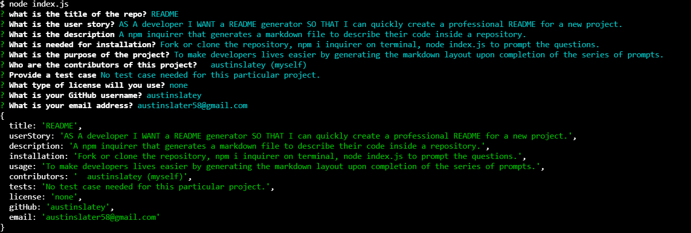

#README

  ##Table of Contents

  * [User-Story](#user-story)
  * [Description](#description)
  * [Installation](#installation)
  * [Usage](#usage)
  * [Contributions](#contributions)
  * [Tests](#tests)
  * [License](#license)
  * [Screenshots](#screenshots)
  * [Questions](#questions)

 
  

  ---

  ## User-Story
  AS A developer I WANT a README generator SO THAT I can quickly create a professional README for a new project.

  ## Description
  A npm inquirer that generates a markdown file to describe their code inside a repository.

  ## Installation
  Fork or clone the repository, npm i inquirer on terminal, node index.js to prompt the questions.

  ## Usage
  To make developers lives easier by generating the markdown layout upon completion of the series of prompts.

  ## Contributions
    austinslatey (myself)

  ## Tests
  No test case needed for this particular project.

  ## License 
  none

  ## Screenshots
  

  ## Demonstration
  
  

  ## Questions

  If any questions arise..

  Visit my Github at: [https://github.com/austinslatey](https://github.com/austinslatey)

  Reach out to me by email: austinslater58@gmail.com
  
